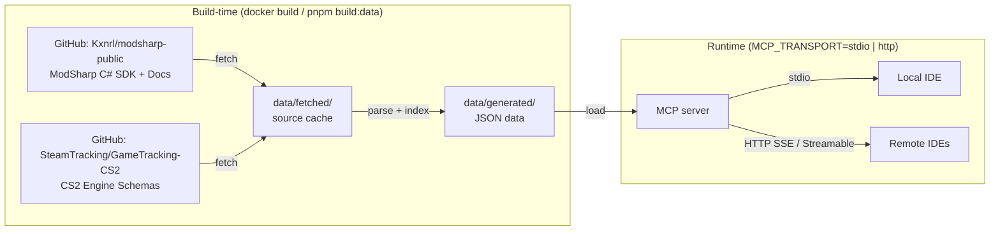

# ModSharp MCP Server

An MCP (Model Context Protocol) server that exposes ModSharp CS2 modding framework documentation and API reference to IDE-integrated AI agents (Claude Code, Cursor, VS Code Copilot, etc.).

## What It Does

Provides 6 MCP tools and 447+ resources that allow AI assistants to:

- **Search documentation** across 88 bilingual (EN/CN) articles
- **Browse the API surface** of 326 types (180 interfaces, 75 enums, 56 structs, 15 classes)
- **Look up type details** with members, summaries, and syntax
- **Retrieve code examples** (34 complete C# examples)
- **Navigate the namespace hierarchy** (21 namespaces)

## Quick Start

```bash
# Install dependencies
pnpm install

# Fetch source data from GitHub + parse + build search index
pnpm build:data

# Build the MCP server
pnpm build

# Run locally
pnpm start
```

The `build:data` command automatically fetches the latest source files from [github.com/Kxnrl/modsharp-public](https://github.com/Kxnrl/modsharp-public) via the GitHub API and caches them locally. Re-running skips already-downloaded files.

## IDE Configuration

### Option A: Remote Server

A public instance is available at `modsharp.hnrobert.space`.

| Endpoint | Protocol | Clients |
|----------|----------|---------|
| `https://modsharp.hnrobert.space/sse` | SSE (2024-11-05) | Cursor, older clients |
| `https://modsharp.hnrobert.space/mcp` | Streamable HTTP (2025-03-26) | Claude Code, newer clients |

#### Claude Code

Add to `.mcp.json`:

```json
{
  "mcpServers": {
    "modsharp": {
      "url": "https://modsharp.hnrobert.space/mcp"
    }
  }
}
```

#### Cursor

Add to `.cursor/mcp.json`:

```json
{
  "mcpServers": {
    "modsharp": {
      "url": "https://modsharp.hnrobert.space/sse"
    }
  }
}
```

#### Self-hosting

```bash
docker pull ghcr.io/hnrobert/modsharp-public-mcp:latest
docker run -d -p 3045:3045 -e MCP_TRANSPORT=http ghcr.io/hnrobert/modsharp-public-mcp:latest
```

### Option B: Local Docker (stdio)

```bash
docker pull ghcr.io/hnrobert/modsharp-public-mcp:latest
```

Use in IDE config:

```json
{
  "mcpServers": {
    "modsharp": {
      "command": "docker",
      "args": ["run", "--rm", "-i", "ghcr.io/hnrobert/modsharp-public-mcp:latest"]
    }
  }
}
```

### Option C: Local Node.js

```bash
pnpm install && pnpm build:data && pnpm build
```

Then use `"command": "node", "args": ["/path/to/modsharp-public-mcp/dist/index.js"]` in the config above.

## MCP Tools

| Tool | Description |
|------|-------------|
| `search_docs` | Full-text search across all documentation, API types, examples, and CS2 schemas |
| `search_api` | Search ModSharp API types and members by keyword |
| `get_api_type` | Get full details of a specific ModSharp API type |
| `list_namespace` | Browse the ModSharp namespace/type hierarchy |
| `get_guide` | Retrieve a documentation article |
| `get_code_example` | Get a code example by ID |
| `search_schemas` | Search CS2 engine schema classes (CBaseEntity, C_CSPlayerPawn, etc.) |
| `get_schema_type` | Get full details of a CS2 schema class (fields, network vars) |

## MCP Resources

- `modsharp://api/{namespace}/{typeName}` - ModSharp API type info (JSON)
- `modsharp://docs/{locale}/{path}` - Documentation articles (Markdown)
- `modsharp://examples/{id}` - Code examples (plain text)
- `modsharp://schema/{category}/{className}` - CS2 engine schema classes (JSON)
- `modsharp://namespaces` - Full namespace hierarchy (JSON)
- `modsharp://toc` - Documentation table of contents (JSON)

## Data Stats (as of v0.2.2)

- **624** ModSharp API types with **7044** members
- **633** CS2/Source2 engine schema classes across **7** categories with **1553** network fields
- **44** English + **44** Chinese documentation articles
- **34** code examples
- **14969** search index tokens

## Development

```bash
pnpm fetch        # Fetch latest source data from GitHub
pnpm build:data   # Fetch + parse + index (full data rebuild)
pnpm dev          # Run with hot reload
pnpm build        # Build server
pnpm test         # Run tests
pnpm typecheck    # Type check
```

## Architecture



**Build-time** (baked into Docker image, no network at runtime):

1. Fetch — Downloads source files from GitHub (modsharp-public + GameTracking-CS2), caches locally
2. Parse — Extracts API types from C# sources, articles from markdown, CS2 schemas from engine headers
3. Index — Builds a token-based search index

Only `data/generated/` (final JSON) enters the Docker image.

**Runtime** (fully offline, no network needed):

- `MCP_TRANSPORT=stdio` (default) — local IDE via stdin/stdout
- `MCP_TRANSPORT=http` — remote IDEs via HTTP (`/sse` + `/mcp` endpoints)

<!-- ## License -->

<!-- TODO -->
