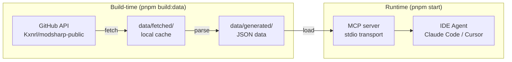

# ModSharp MCP Server

An MCP (Model Context Protocol) server that exposes ModSharp CS2 modding framework documentation and API reference to IDE-integrated AI agents (Claude Code, Cursor, VS Code Copilot, etc.).

## What It Does

Provides 6 MCP tools and 447+ resources that allow AI assistants to:

- **Search documentation** across 88 bilingual (EN/CN) articles
- **Browse the API surface** of 326 types (180 interfaces, 75 enums, 56 structs, 15 classes)
- **Look up type details** with members, summaries, and syntax
- **Retrieve code examples** (34 complete C# examples)
- **Navigate the namespace hierarchy** (21 namespaces)

## Quick Start

```bash
# Install dependencies
pnpm install

# Fetch source data from GitHub + parse + build search index
pnpm build:data

# Build the MCP server
pnpm build

# Run locally
pnpm start
```

The `build:data` command automatically fetches the latest source files from [github.com/Kxnrl/modsharp-public](https://github.com/Kxnrl/modsharp-public) via the GitHub API and caches them locally. Re-running skips already-downloaded files.

## IDE Configuration

### Claude Code

Add to `.mcp.json` in your project root:

```json
{
  "mcpServers": {
    "modsharp": {
      "command": "node",
      "args": ["/path/to/modsharp-public-mcp/dist/index.js"]
    }
  }
}
```

### Cursor

Add to `.cursor/mcp.json`:

```json
{
  "mcpServers": {
    "modsharp": {
      "command": "node",
      "args": ["/path/to/modsharp-public-mcp/dist/index.js"]
    }
  }
}
```

## MCP Tools

| Tool | Description |
|------|-------------|
| `search_docs` | Full-text search across all documentation, API types, and examples |
| `search_api` | Search API types and members by keyword |
| `get_api_type` | Get full details of a specific API type |
| `list_namespace` | Browse the namespace/type hierarchy |
| `get_guide` | Retrieve a documentation article |
| `get_code_example` | Get a code example by ID |

## MCP Resources

- `modsharp://api/{namespace}/{typeName}` - API type info (JSON)
- `modsharp://docs/{locale}/{path}` - Documentation articles (Markdown)
- `modsharp://examples/{id}` - Code examples (plain text)
- `modsharp://namespaces` - Full namespace hierarchy (JSON)
- `modsharp://toc` - Documentation table of contents (JSON)

## Data Stats

- **326** parsed C# types with **3,772** members
- **44** English + **44** Chinese documentation articles
- **34** code examples
- **6,699** search index tokens

## Development

```bash
pnpm fetch        # Fetch latest source data from GitHub
pnpm build:data   # Fetch + parse + index (full data rebuild)
pnpm dev          # Run with hot reload
pnpm build        # Build server
pnpm test         # Run tests
pnpm typecheck    # Type check
```

## Architecture



**Build-time** (no network at runtime):

1. `pnpm fetch` — Downloads source files from GitHub via API, caches by file size
2. Parse — Extracts API types from C# sources and articles from markdown
3. Index — Builds a token-based search index

**Runtime** (offline, no network needed):

- MCP server loads generated JSON into memory, serves via stdio transport

<!-- ## License -->

<!-- TODO -->
